<p align="center">
  
</p>

<h1 align="center">👗 Stylish — E-Commerce App</h1>

<p align="center">
  A beautifully crafted, fully functional e-commerce mobile application built with <strong>Flutter</strong>. Browse trending products, manage your cart, and enjoy a seamless checkout experience — all wrapped in a stunning, modern UI.
</p>

<p align="center">
  
  
  
  
</p>

<p align="center">
  <a href="https://sylishstore.vercel.app/">
    
  </a>
</p>

---

## ✨ Features

| Feature | Description |
|---------|-------------|
| 🏠 **Home Screen** | Curated banners, deal of the day, trending products & special offers |
| 🔍 **Product Catalog** | Browse all products with sorting and filtering options |
| 📦 **Product Details** | View full product info with images, ratings, price & add to cart/wishlist |
| 🛒 **Shopping Cart** | Add/remove items, update quantities, view order totals |
| ❤️ **Wishlist** | Save your favorite products for later |
| 💳 **Checkout Flow** | Multi-step checkout: Profile → Summary → Payment |
| 🎉 **Order Success** | Animated success confirmation after placing an order |
| 🔐 **Authentication** | Login, Sign Up & Forgot Password screens |
| 🎨 **Onboarding** | Beautiful 3-step introduction screens for new users |
| ⚙️ **Settings** | Profile management, notifications & app preferences |
| 📱 **Device Preview** | Web preview with iPhone 16 Pro Max frame |
| 🖼️ **Custom Splash** | Native + animated splash screen with app logo |

---

## 📸 Screenshots

<p align="center">
  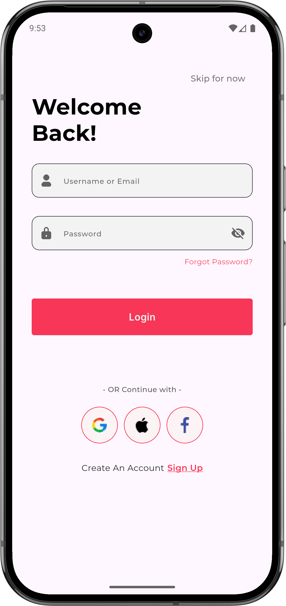
  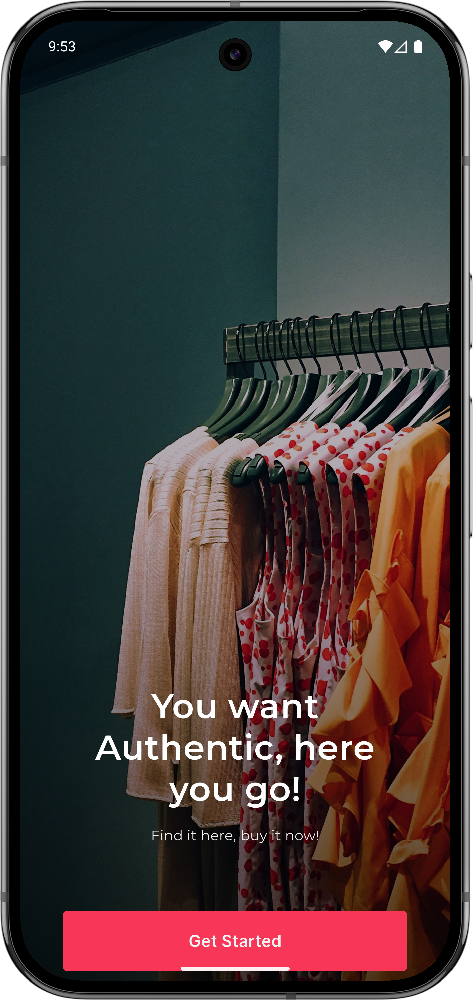
  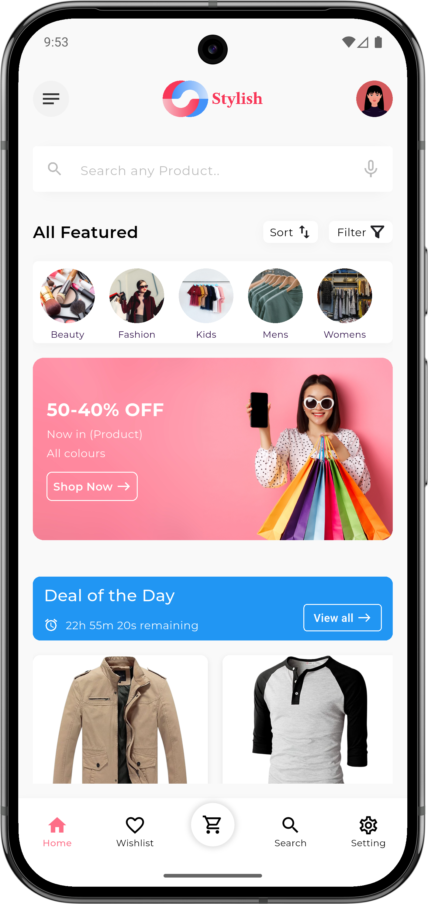
  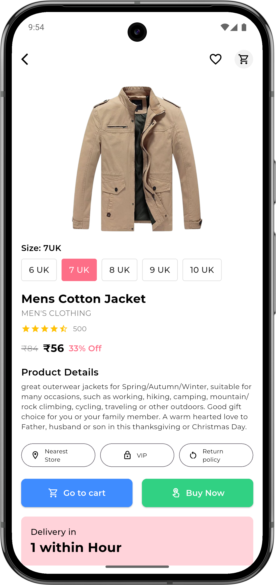
</p>

<p align="center">
  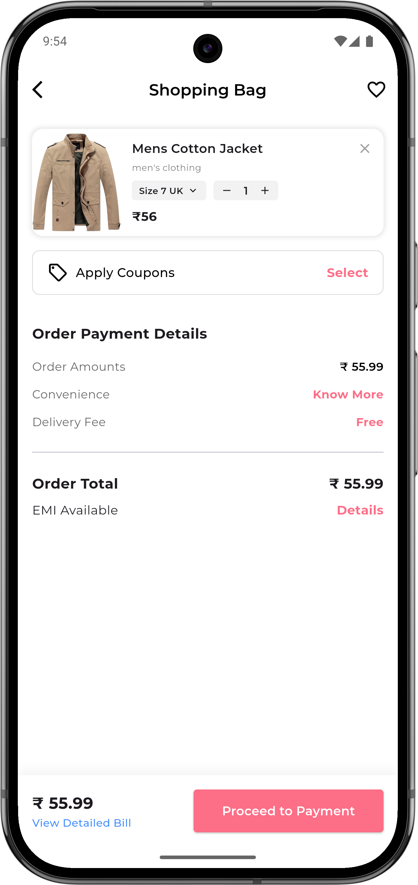
  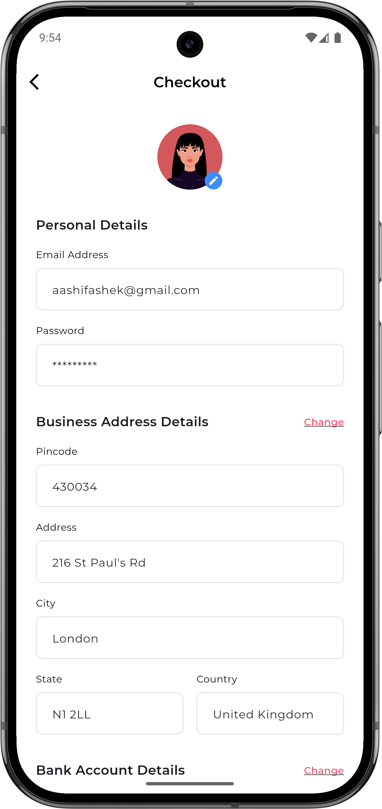
  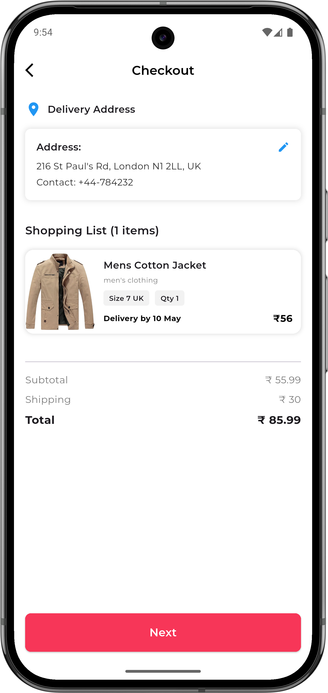
  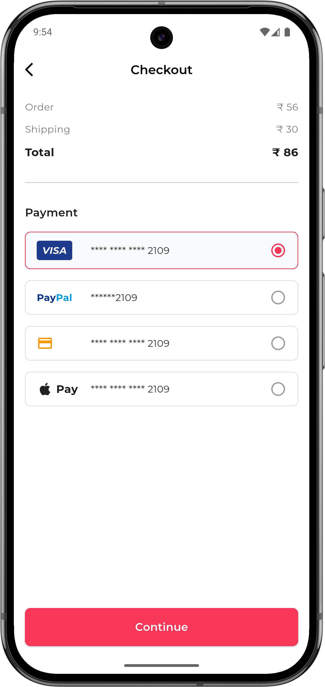
</p>

<p align="center">
  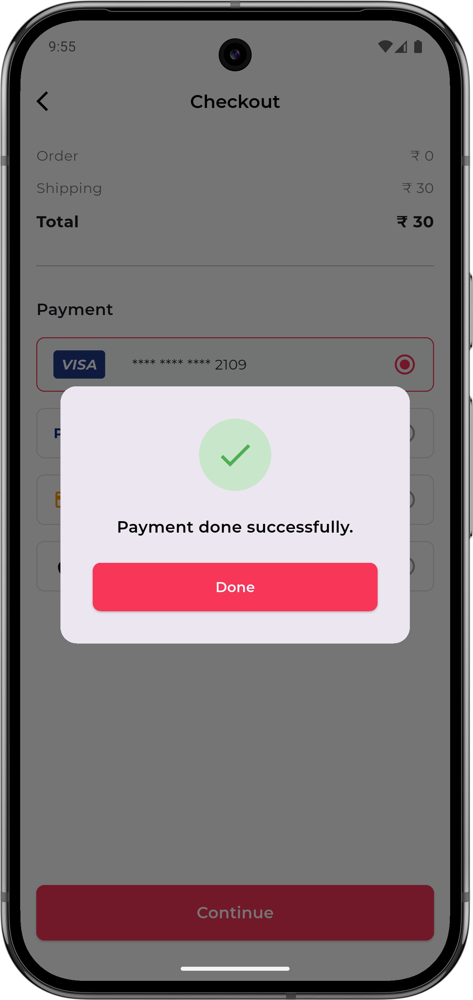
  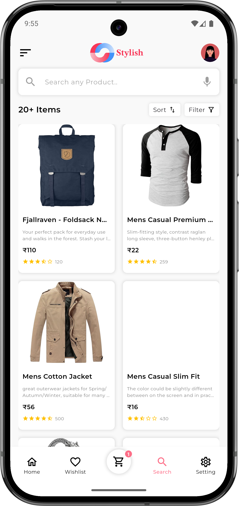
  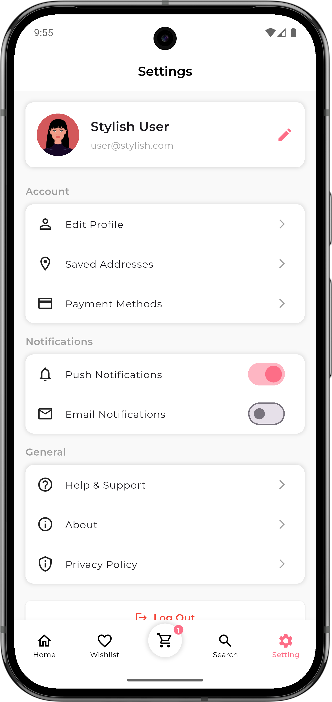
</p>

---

## 🏗️ Tech Stack

- **Framework**: Flutter 3.x
- **Language**: Dart
- **State Management**: Provider (ChangeNotifier)
- **API**: Fake Store API for product data
- **Fonts**: Google Fonts (Montserrat)
- **Icons**: Flutter Launcher Icons
- **Splash**: Flutter Native Splash
- **Preview**: Device Preview (Web)

---

## 📂 Project Structure

```
lib/
├── main.dart                  # App entry point
├── models/
│   └── product.dart           # Product data model
├── providers/
│   ├── cart_provider.dart      # Cart state management
│   └── wishlist_provider.dart  # Wishlist state management
├── services/
│   └── api_service.dart        # API calls to Fake Store API
├── screens/
│   ├── splash/                 # Splash screen
│   ├── onboarding/             # Onboarding slides
│   ├── login/                  # Login screen
│   ├── signup/                 # Sign up screen
│   ├── forgotPassword/         # Forgot password
│   ├── home/                   # Home with banners & deals
│   ├── catalog/                # Product catalog grid
│   ├── product_details/        # Product detail page
│   ├── cart/                   # Shopping cart
│   ├── checkout/               # Checkout flow (3 steps)
│   ├── wishlist/               # Wishlist screen
│   └── settings/               # Settings & profile
└── widgets/                    # Reusable components
```

---

## 🚀 Getting Started

### Prerequisites
- Flutter SDK (3.x or later)
- Dart SDK
- Android Studio / VS Code

### Installation

```bash
# Clone the repository
git clone https://github.com/yourusername/Sylish.git
cd Sylish

# Install dependencies
flutter pub get

# Run the app
flutter run
```

### Build Release APK

```bash
flutter build apk --release
```

---

## 🤝 Contributing

Contributions, issues, and feature requests are welcome! Feel free to open an issue or submit a pull request.

---

## 📄 License

This project is licensed under the MIT License.

---

<p align="center">
  Made with ❤️ using Flutter
</p>
